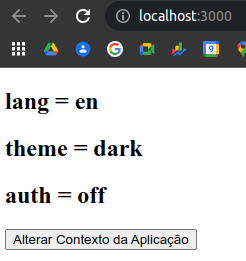

# ReactJS - Hooks - useContext

## Exercício

Execute as seguintes tarefas:

### 1) Crie um software que guarde as seguintes variáveis utilizando o Hook useContext:

lang  
theme  
auth  

Essas variáveis devem ter, inicialmente, os seguintes valores:

lang = 'en'  
theme = 'dark'  
auth = 'off'  

### 2) Crie um botão na sua aplicação que altere os valores armazenados no contexto da aplicação, de acordo com a imagem abaixo:

### 3) Após o primeiro clique no botão, os valores devem ser alterados, conforme imagem abaixo:

### 4) A aplicação deve assegurar que os valores do contexto sejam persistidos, de maneira que um refresh não recarregue os valores iniciais.